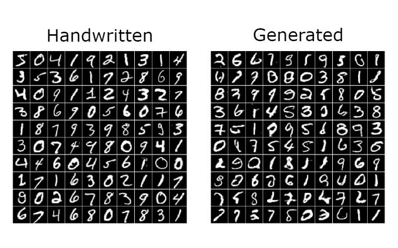

# DCGAN in TensorFlow

This is a TensorFlow implementation of a Deep Convolutional Generative Adversarial Network (DCGAN) applied on a the simple task of generating handwritten images. For more information check out my blog article about DCGANs https://cfml.se/blog/dcgans/.
